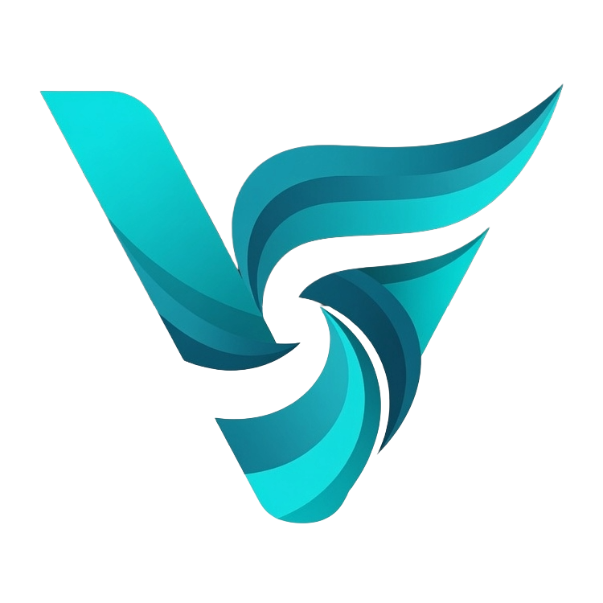

<p align="center">
  
</p>

<h1 align="center">VortexFlow</h1>

<p align="center"><strong>The open-source control plane for your Vector fleet.</strong> A free, self-hosted GUI for building pipelines and operating them across a whole fleet of Vector instances — render &amp; deploy config, staged version rollouts, pre-deploy validation, and live event taps, all from one UI.</p>

> **Status:** v1.0.0 — first public release. The core is feature-complete and
> security-reviewed, but it's a young project: it hasn't yet been hardened under
> heavy load or large multi-fleet deployments. Kick the tires, run it on real
> fleets, and tell us what breaks — issues and feedback are very welcome.

---

## What is VortexFlow?

VortexFlow gives Vector a visual control plane: a web UI for building pipelines, editing VRL transforms, managing routing logic, and monitoring pipeline health across one or many Vector instances.

If you're managing Vector config by hand — juggling YAML files, SSHing into boxes to check throughput, copying VRL snippets between pipelines — VortexFlow is built for you.

**VortexFlow is:**
- A **fleet manager** — group instances into Fleets that share one config; render that config and deploy it to every member at once
- A **staged rollout** engine — pin a Vector version per fleet and upgrade one fleet at a time, gated by a server-side `vector validate` + port-collision lint
- A visual DAG editor for Vector sources, transforms, routes, and sinks, with a source/sink catalog generated from Vector's own schema
- A VRL editor with syntax highlighting, live output preview, instant **server-side validate** (no instance needed), and a reusable transform library with `.vrl`/pack **import & export**
- A health dashboard (throughput by fleet, errors, rollout convergence) and a **live event tap** on any node
- Pull-based agents that validate-then-reload, bootstrapped into a fleet with a one-liner

**VortexFlow is not:**
- A log search or analytics tool
- A metrics visualization tool (use Grafana)
- A SaaS product — fully self-hosted, no phone-home, no license check

---

## Quick Start

```bash
# All commands run from the docker/ directory:
cd docker

# The demo needs exactly one secret — generate it into .env:
echo "VORTEXFLOW_SECRET_KEY=$(openssl rand -hex 32)" > .env

# Spin up VortexFlow + a self-registering demo Vector agent
docker compose -f docker-compose.yml -f docker-compose.demo.yml up -d

# Open https://localhost  (self-signed cert — accept the warning)
# Demo login: admin@example.com / ChangeMe123!  (you'll set a new password)
```

This is the **demo** stack: it adds a real Vector agent and a metrics generator
so fleets, health, and live taps work out of the box. For a real deployment
against your own Vector instances, see the
[Installation guide](docs/guide/getting-started/installation.md).

Vector must be running with its API enabled for health and topology queries.

---

## Documentation

Full user and operator docs live in **[`docs/guide/`](docs/guide/README.md)** — getting started, core concepts, task guides, administration, and reference. A few entry points:

- [Introduction](docs/guide/getting-started/introduction.md) and [Quickstart](docs/guide/getting-started/quickstart.md)
- Concepts: [Fleets](docs/guide/concepts/fleets.md) · [Instances & Agents](docs/guide/concepts/instances-and-agents.md) · [Render, Deploy & Rollout](docs/guide/concepts/deploy-and-rollout.md)
- Guides: [Connect an instance](docs/guide/guides/connect-an-instance.md) · [Deploy to a fleet](docs/guide/guides/deploy-to-a-fleet.md) · [Staged version rollout](docs/guide/guides/version-rollout.md)

---

## Core Concepts

### Fleets
A **Fleet** is a named group of Vector instances sharing a pipeline configuration. Every instance belongs to exactly one fleet. A **Default** fleet is created on first boot and cannot be deleted.

Instances within a fleet have a role:
- **Agent** — lightweight edge collector (Vector agent role)
- **Aggregator** — central processor that receives from agents

Bootstrap a new agent into a fleet with a single generated command:
```bash
curl -sL https://your-vortexflow/install/fleet/<id>?token=<token> | sudo bash
```

### Flow — build in place
Visual DAG showing sources, transforms, routes, and sinks as nodes. **Click any node to configure it right on the canvas** — a side drawer opens with its config form (generated from Vector's own JSON schema), VRL editor, or route branches, plus **Fed by / Feeds** wiring chips and an inline **before/after live tap**. Add a node and its drawer opens to configure it immediately. The canvas *is* the Vector config; changes are written as native Vector YAML. (The Transforms and Catalog pages are searchable list/library companions that open nodes back in Flow.)

### Render, Deploy & Rollout
VortexFlow compiles a fleet's topology into one valid Vector config and publishes it to every member — local mode writes the file, agent mode pulls and validate-then-reloads. Every deploy is gated by a server-side `vector validate` + a port-collision lint. A fleet **generation** counter tracks convergence (`42/42`), and a per-fleet **desired Vector version** drives staged binary upgrades, one fleet at a time.

### VRL Editor & Library
Syntax-highlighted VRL editor with an input sample → transformed output preview, backed by a reusable transform library in PostgreSQL. **Validate** compile-checks and runs your VRL instantly using the bundled Vector binary — **no live instance required** — surfacing Vector's own compiler diagnostics (or run against a real instance for the full path). **Import / export** lets you pull in a `.vrl` file or share the whole library as a portable `vrl-transforms` JSON pack.

### AI Transform Assistant — opt-in, bring-your-own-LLM
Describe a transform and give it a sample event; the assistant writes VRL, **compiles it with the bundled Vector binary, and self-repairs on error** — so you only ever get VRL that's *validated, not just generated*, shown before/after on the real event. It's **self-hosted / no-phone-home**: point it at Anthropic, OpenAI, or any OpenAI-compatible **local** endpoint (Ollama, vLLM) for a fully air-gapped setup. Off by default; the key is encrypted at rest, and you choose which fields (if any) to redact before a sample is sent. Available in the Library ("New with AI") and on any Flow remap node.

> **A note on model choice:** output quality scales with the model — VRL is a niche language, so a capable model (e.g. a frontier hosted model, or a larger local coder model) produces clean transforms, while a very small local model may not write valid VRL. The validate-and-self-repair loop guarantees you never get *invalid* VRL regardless, but a weak model may simply fail to converge. This gap should narrow as local models improve.

### Health Dashboard & Live Tap
Per-fleet throughput (toggle **events/s ↔ bytes/s**), **volume reduction** (ingest→egress bytes — how much the pipeline is actually saving), per-instance health (**backpressure, dropped events, sink-delivery failures**), errors, and rollout convergence — metrics pushed by Vector to VictoriaMetrics via `prometheus_remote_write`. A sick node raises a first-class **alert** (in-app notification center + outbound channels).

**Live Tap** samples real events off any node straight from Vector's tap API (no retention), with live **filtering**, **field/schema inference**, and a **before/after compare** that taps a transform's input and output side-by-side — so you can see exactly what a remap did to each event.

### Guardrails
Destructive actions are guarded: deleting a source, sink, transform, or route that's still wired returns a clear **"in use by …"** error with an explicit force-delete escape hatch, and deleting a fleet shows its full blast radius (config destroyed, instances detached) behind a **type-`DELETE`-to-confirm** prompt.

---

## Stack

| Layer | Technology |
|-------|-----------|
| Backend | FastAPI (Python 3.12), PostgreSQL, Redis |
| Frontend | React + Vite + TypeScript, Tailwind CSS, React Flow |
| Metrics | VictoriaMetrics (time-series), Vector `internal_metrics` → remote_write |
| Auth | Local accounts + RBAC + brute-force lockout + SSO (OIDC, Azure Entra, SAML 2.0, LDAP/AD — JIT + group→role) |
| Deploy | Docker Compose |

---

## Development Status

| Phase | Status | Description |
|-------|--------|-------------|
| P1 | ✅ Done | Auth, RBAC, user management, instance management |
| P2 | ✅ Done | Pipeline DAG viewer, pipeline CRUD |
| P3 | ✅ Done | VRL editor, transform library, dark/light theme |
| P4 | ✅ Done | Fleet manager — config render + deploy engine, pull-based agents, health dashboard |
| P5 | ✅ Done | Source/Sink catalog (guided forms generated from Vector's schema) |
| P6 | ✅ Done | Routing builder (visual branch conditions, VRL expressions) |
| P7 | ✅ Done | Version history + rollback, cert store, notifications, staged Vector version rollout, live tap |
| P8 | ✅ Done | v1 hardening — encrypted credentials at rest, cert↔TLS delivery, setup-token onboarding, nginx CSP; audit logging; SSO (OIDC, Azure, SAML, LDAP) built & proven; release hygiene (OSS files, dependency audit, tested backup/restore); CI security scanning (GitHub Actions, CodeQL, Dependabot, gitleaks) |

---

## Zero Lock-in

All pipeline config output is standard Vector YAML. If you stop using VortexFlow, your Vector config continues to work without modification. VortexFlow never writes proprietary fields or wrappers into your pipeline files.

---

## License

[Mozilla Public License 2.0](LICENSE) — the same license as Vector.
